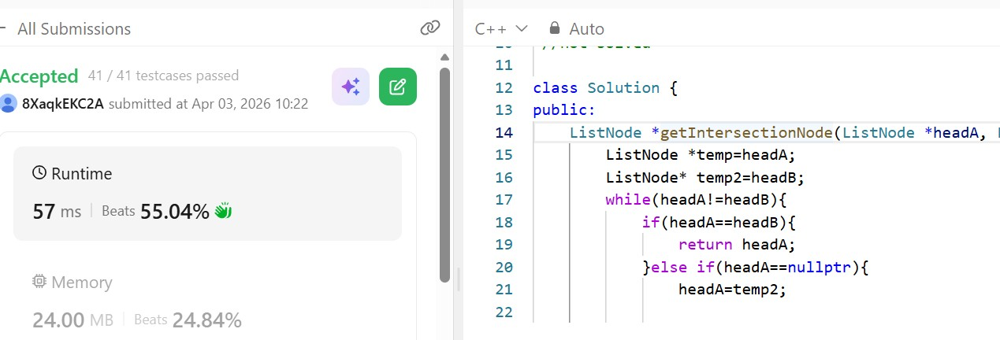

# Day 13 - POTD

## Problem Description
You are given two singly linked lists that may or may not connect at some point; if they do connect, they will share the same nodes from that point onward. 
Your task is to find the first node where both lists meet, meaning the exact same node in memory, 
not just a node with the same value. If the two lists never connect, you should return null. The lists must remain unchanged after your function runs.

## Approach

Uses two pointers starting at the heads of both linked lists
Each pointer moves one step at a time through its list
When a pointer reaches the end, it switches to the head of the other list
This makes both pointers travel equal total distance (lengthA + lengthB)
If an intersection exists, both pointers meet at the intersecting node
If no intersection exists, both pointers become null at the same time
Time complexity is linear, O(n + m)
Space complexity is constant, O(1)

## 👨‍💻 Code

/**
 * Definition for singly-linked list.
 * struct ListNode {
 *     int val;
 *     ListNode *next;
 *     ListNode(int x) : val(x), next(NULL) {}
 * };
 */

 //not solved
 
class Solution {
public:
    ListNode *getIntersectionNode(ListNode *headA, ListNode *headB) {
        ListNode *temp=headA;
        ListNode* temp2=headB;
        while(headA!=headB){
            if(headA==headB){
                return headA;
            }else if(headA==nullptr){
                headA=temp2;
            }else if(headB==nullptr){
                headB=temp;
            }else{
                headA=headA->next;
                headB=headB->next;
            }
        }
        
        return headA;
        
    }
};
## 📸 Screenshot

