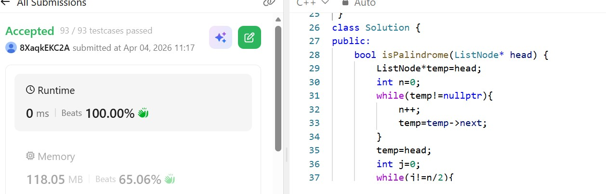

# Day 14 - POTD

## Problem Description
Given the head of a singly linked list, return true if it is a palindrome or false otherwise.

## Approach

This approach checks whether a singly linked list is a palindrome by reversing its second half and then comparing it with the first half.

First, the code traverses the list to calculate its length `n`. Then, it moves a pointer `temp` to the start of the second half (`n/2` steps from the head). The helper function `reversing` is used to reverse the second half of the list in-place.

After reversing, two pointers are used:

* One starting from the head (first half)
* The other from the reversed second half

These pointers move forward simultaneously, comparing node values. If any mismatch is found, the list is not a palindrome. If all corresponding values match, the list is a palindrome.

**Key points:**

* Time Complexity: **O(n)** (single pass for length + half traversal + reverse + compare)
* Space Complexity: **O(1)** (in-place reversal, no extra memory)
* Efficient because it avoids using extra data structures like arrays or stacks

## 👨‍💻 Code

/**
 * Definition for singly-linked list.
 * struct ListNode {
 *     int val;
 *     ListNode *next;
 *     ListNode() : val(0), next(nullptr) {}
 *     ListNode(int x) : val(x), next(nullptr) {}
 *     ListNode(int x, ListNode *next) : val(x), next(next) {}
 * };
 */
 void reversing(ListNode* &root){
    ListNode* prev=nullptr;
    ListNode*curr=root;
    ListNode* after=root->next;
    while(curr!=nullptr){
        curr->next=prev;
        prev=curr;
        curr=after;
        if(after!=nullptr){
            after=after->next;
        }
        
    }
    root=prev;
 }
class Solution {
public:
    bool isPalindrome(ListNode* head) {
        ListNode*temp=head;
        int n=0;
        while(temp!=nullptr){
            n++;
            temp=temp->next;
        }
        temp=head;
        int j=0;
        while(j!=n/2){
            temp=temp->next;
            j++;
        }
        reversing(temp);
        while(temp!=nullptr){
            if(head->val!=temp->val){
                return false;   
            }
            head=head->next;
            temp=temp->next;
        }
        return true;   
    }
};
## 📸 Screenshot

