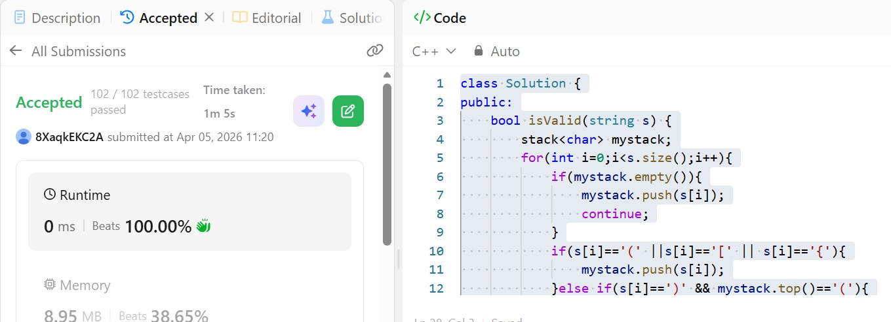

# Day 15 - POTD

## Problem Description
Given a string s containing just the characters '(', ')', '{', '}', '[' and ']', determine if the input string is valid.

An input string is valid if:

Open brackets must be closed by the same type of brackets.
Open brackets must be closed in the correct order.
Every close bracket has a corresponding open bracket of the same type.

## Approach

This solution checks whether a string of brackets is valid using a **stack-based approach**, which is a standard technique for problems involving matching pairs.

The idea is to iterate through each character of the string:

* If the current character is an **opening bracket** (`(`, `{`, `[`), it is pushed onto the stack.
* If the character is a **closing bracket** (`)`, `}`, `]`), the algorithm checks the top of the stack:

  * If the top contains the corresponding matching opening bracket, it is popped from the stack.
  * Otherwise, the closing bracket is pushed onto the stack, indicating a mismatch.

At the end of the traversal:

* If the stack is **empty**, all brackets were matched correctly, so the string is valid.
* If the stack is **not empty**, there are unmatched brackets, so the string is invalid.

This approach works because a stack follows the **Last In, First Out (LIFO)** principle, which naturally fits the requirement of matching the most recent unmatched opening bracket with the current closing bracket.

The time complexity is **O(n)** since each character is processed once, and the space complexity is also **O(n)** in the worst case when all characters are opening brackets.

## 👨‍💻 Code

class Solution {
public:
    bool isValid(string s) {
        stack<char> mystack;
        for(int i=0;i<s.size();i++){
            if(mystack.empty()){
                mystack.push(s[i]);
                continue;
            }
            if(s[i]=='(' ||s[i]=='[' || s[i]=='{'){
                mystack.push(s[i]);
            }else if(s[i]==')' && mystack.top()=='('){
                mystack.pop();  
            }else if(s[i]=='}' && mystack.top()=='{'){
                mystack.pop();  
            }else if(s[i]==']' && mystack.top()=='['){
                mystack.pop();  
            }else{
                mystack.push(s[i]);
            }
        }
        if(mystack.empty()){
            return true;
        }else{
            return false;
        }        
    }
};
## 📸 Screenshot

