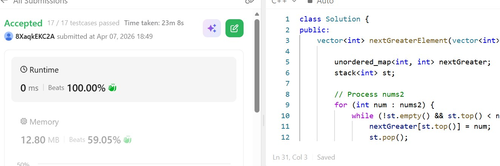

# Day 17 - POTD

## Problem Description
The next greater element of some element x in an array is the first greater element that is to the right of x in the same array.

You are given two distinct 0-indexed integer arrays nums1 and nums2, where nums1 is a subset of nums2.

For each 0 <= i < nums1.length, find the index j such that nums1[i] == nums2[j] and determine the next greater element of nums2[j] in nums2. If there is no next greater element, then the answer for this query is -1.

Return an array ans of length nums1.length such that ans[i] is the next greater element as described above.

## Approach

### 📝 Short Note: Next Greater Element (Monotonic Stack Approach)

The **Next Greater Element** problem is efficiently solved using a **monotonic decreasing stack**. The idea is to traverse the array (`nums2`) and maintain a stack that stores elements in decreasing order.

When a new element is encountered, we compare it with the top of the stack:

* If the current element is **greater**, it becomes the *next greater element* for all smaller elements on the stack.
* We keep popping from the stack and record their next greater values.
* If no greater element exists, we assign `-1`.

A hash map is used to store the next greater element for each number in `nums2`, allowing quick lookup when building the result for `nums1`.

### Key Advantages:

* Time Complexity: **O(n)**
* Avoids brute force comparisons
* Efficient due to single traversal

This approach leverages the stack to process elements only once, making it optimal for such problems.

## 👨‍💻 Code

class Solution {
public:
    vector<int> nextGreaterElement(vector<int>& nums1, vector<int>& nums2) {
        unordered_map<int, int> nextGreater;
        stack<int> st;
        // Process nums2
        for (int num : nums2) {
            while (!st.empty() && st.top() < num) {
                nextGreater[st.top()] = num;
                st.pop();
            }
            st.push(num);
        }

        // Remaining elements → no greater
        while (!st.empty()) {
            nextGreater[st.top()] = -1;
            st.pop();
        }

        // Build result for nums1
        vector<int> result;
        for (int num : nums1) {
            result.push_back(nextGreater[num]);
        }

        return result;
    }
};
## 📸 Screenshot

