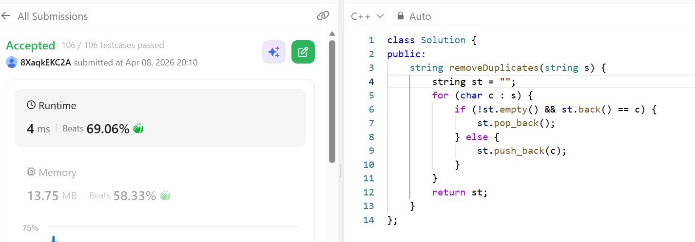

# Day 18 - POTD

## Problem Description

You are given a string s consisting of lowercase English letters. A duplicate removal consists of choosing two adjacent and equal letters and removing them.

We repeatedly make duplicate removals on s until we no longer can.

Return the final string after all such duplicate removals have been made. It can be proven that the answer is unique.

## Approach

Use a stack to process characters.
For each character:
If stack is not empty and top equals current character, pop from stack.
Otherwise, push current character.
Build result from stack.
Idea: Stack naturally handles adjacent duplicates by allowing immediate pairing and removal.

Time: O(n)
Space: O(n)

## 👨‍💻 Code
class Solution {
public:
    string removeDuplicates(string s) {
        string st = "";
        for (char c : s) {
            if (!st.empty() && st.back() == c) {
                st.pop_back();
            } else {
                st.push_back(c);
            }
        }
        return st;
    }
};

## 📸 Screenshot

