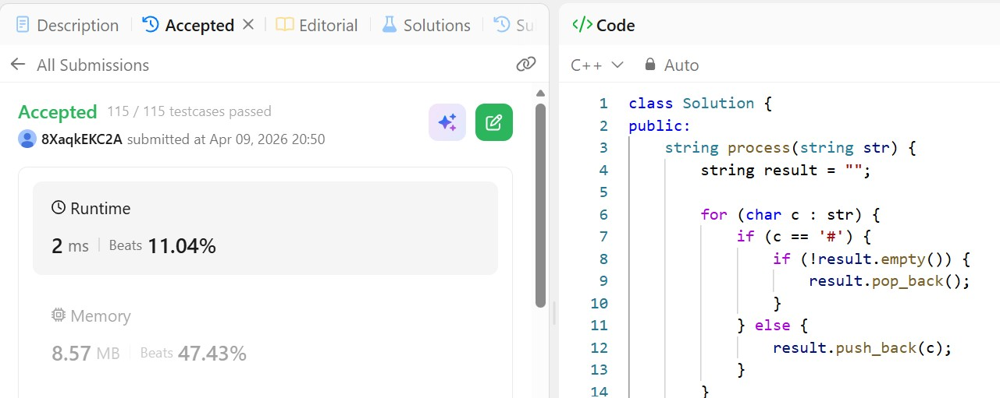

# Day 19 - POTD

## Problem Description

Given two strings s and t, return true if they are equal when both are typed into empty text editors. '#' means a backspace character.

Note that after backspacing an empty text, the text will continue empty.

## Approach

* Simulate the typing process using a stack (or string).
* For each character:

  * If it is a normal character, push it into the stack.
  * If it is `#`, remove the last character (if the stack is not empty).
* This mimics how a text editor processes backspaces.
* After processing both strings, compare the final constructed strings.

**Complexity:**

* Time: O(n + m)
* Space: O(n + m) (for storing processed strings)

## 👨‍💻 Code
class Solution {
public:
    string process(string str) {
        string result = "";
        
        for (char c : str) {
            if (c == '#') {
                if (!result.empty()) {
                    result.pop_back();
                }
            } else {
                result.push_back(c);
            }
        }
        
        return result;
    }
    
    bool backspaceCompare(string s, string t) {
        return process(s) == process(t);
    }
};

## 📸 Screenshot

