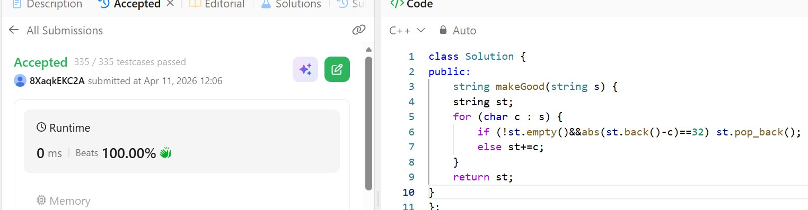

# Day 22 - POTD

## Problem Description
You are given an image represented by an m x n grid of integers image, where image[i][j] represents the pixel value of the image. You are also given three integers sr, sc, and color. Your task is to perform a flood fill on the image starting from the pixel image[sr][sc].

To perform a flood fill:

Begin with the starting pixel and change its color to color.
Perform the same process for each pixel that is directly adjacent (pixels that share a side with the original pixel, either horizontally or vertically) and shares the same color as the starting pixel.
Keep repeating this process by checking neighboring pixels of the updated pixels and modifying their color if it matches the original color of the starting pixel.
The process stops when there are no more adjacent pixels of the original color to update.
Return the modified image after performing the flood fill

## Approach

Use stack
For each char: if stack not empty and stack top is same letter but different case → pop
Else push current char
Return stack as string
Core Idea: Stack removes bad pairs immediately as they form.
Time: O(n) | Space: O(n)

## 👨‍💻 Code

string makeGood(string s) {
    string st;
    for (char c : s) {
        if (!st.empty()&&abs(st.back()-c)==32) st.pop_back();
        else st+=c;
    }
    return st;
}
## 📸 Screenshot

