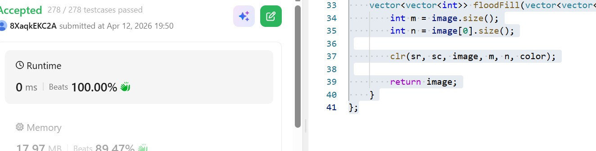

# Day 22 - POTD

## Problem Description
You are given an image represented by an m x n grid of integers image, where image[i][j] represents the pixel value of the image. You are also given three integers sr, sc, and color. Your task is to perform a flood fill on the image starting from the pixel image[sr][sc].

To perform a flood fill:

Begin with the starting pixel and change its color to color.
Perform the same process for each pixel that is directly adjacent (pixels that share a side with the original pixel, either horizontally or vertically) and shares the same color as the starting pixel.
Keep repeating this process by checking neighboring pixels of the updated pixels and modifying their color if it matches the original color of the starting pixel.
The process stops when there are no more adjacent pixels of the original color to update.
Return the modified image after performing the flood fill

## Approach

* Start from the source cell and note its original color
* Change the current cell to the new color
* Recursively visit all 4 directions (up, down, left, right)
* Continue only if the neighbor has the original color and is within bounds
* Recolored cells act as visited, preventing revisits
* Early return avoids unnecessary recursion when color is already the same

---

**Time Complexity:**

* **O(m × n)**
* In the worst case, every cell is visited once

---

**Space Complexity:**

* **O(m × n)** (worst case recursion stack)
* Happens when the entire grid is one connected component
* Average case is smaller depending on region size

## 👨‍💻 Code

class Solution {
public:
    void clr(int i, int j, vector<vector<int>>& image, int m, int n, int color) {

        if (image[i][j] == color) return;

        int og = image[i][j];

        image[i][j] = color;

        int a = i + 1;
        int b = j + 1;
        int c = i - 1;
        int d = j - 1;

        if (a < m && image[a][j] == og) {
            clr(a, j, image, m, n, color);
        } 

        if (c >= 0 && image[c][j] == og) {
            clr(c, j, image, m, n, color);
        } 
        if (d >= 0 && image[i][d] == og) {
            clr(i, d, image, m, n, color);
        } 
        if (b < n && image[i][b] == og) {
            clr(i, b, image, m, n, color);
        }
    }

    vector<vector<int>> floodFill(vector<vector<int>>& image, int sr, int sc, int color) {
        int m = image.size();
        int n = image[0].size();

        clr(sr, sc, image, m, n, color);

        return image;
    }
};
## 📸 Screenshot

