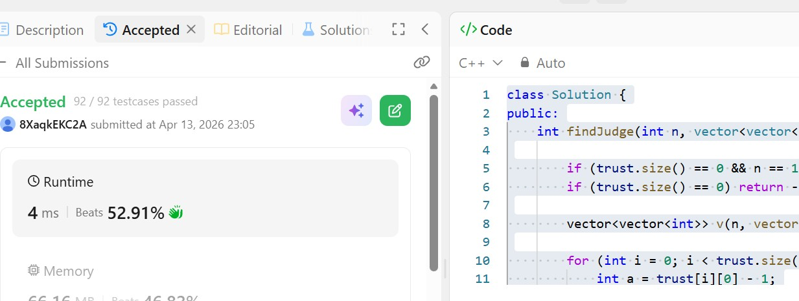

# Day 23 - POTD

## Problem Description
In a town, there are n people labeled from 1 to n. There is a rumor that one of these people is secretly the town judge.

If the town judge exists, then:

The town judge trusts nobody.
Everybody (except for the town judge) trusts the town judge.
There is exactly one person that satisfies properties 1 and 2.
You are given an array trust where trust[i] = [ai, bi] representing that the person labeled ai trusts the person labeled bi. If a trust relationship does not exist in trust array, then such a trust relationship does not exist.

Return the label of the town judge if the town judge exists and can be identified, or return -1 otherwise

**Approach: Using indegree and outdegree (array-based method)**

* Use a 2D vector `v` of size `n x 2` where:

  * `v[i][0]` stores **indegree** (number of people who trust person `i+1`)
  * `v[i][1]` stores **outdegree** (number of people person `i+1` trusts)

* Traverse the `trust` array:

  * For each pair `[a, b]`:

    * Increment `outdegree` of `a`
    * Increment `indegree` of `b`
  * Convert to 0-based indexing by subtracting 1

* Traverse all people from `0` to `n-1`:

  * A person is the judge if:

    * `indegree == n - 1`
    * `outdegree == 0`

* Return `i + 1` (to convert back to 1-based index) if such a person is found, otherwise return `-1`

**Complexity:**

* Time Complexity:

  * O(n + t), where `t = trust.size()`
  * One pass to build counts, one pass to find the judge

* Space Complexity:

  * O(n)
  * Only one vector of size `n` is used

## 👨‍💻 Code

class Solution {
public:
    int findJudge(int n, vector<vector<int>>& trust) {

        if (trust.size() == 0 && n == 1) return 1;
        if (trust.size() == 0) return -1;

        vector<vector<int>> v(n, vector<int>(2, 0));

        for (int i = 0; i < trust.size(); i++) {
            int a = trust[i][0] - 1;
            int b = trust[i][1] - 1;

            v[a][1]++;  
            v[b][0]++; 
        }

        for (int i = 0; i < n; i++) {
            if (v[i][0] == n - 1 && v[i][1] == 0) {
                return i + 1;
            }
        }

        return -1;
    }
};

## 📸 Screenshot

