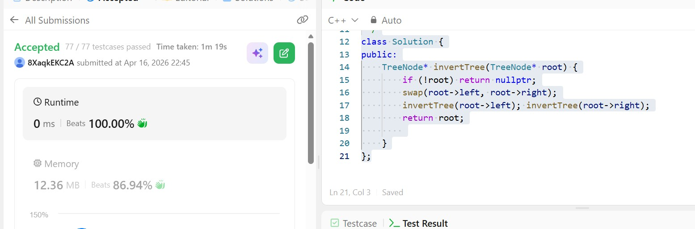

## Day 26 - POTD

## Problem Description
Given the root of a binary tree, invert the tree, and return its root.

## Approach

Recursive DFS
Swap left and right children
Recurse on both sides
Core Idea: Mirror the tree by swapping children at every node.
Time: O(n) | Space: O(h)

## 👨‍💻 Code

/**
 * Definition for a binary tree node.
 * struct TreeNode {
 *     int val;
 *     TreeNode *left;
 *     TreeNode *right;
 *     TreeNode() : val(0), left(nullptr), right(nullptr) {}
 *     TreeNode(int x) : val(x), left(nullptr), right(nullptr) {}
 *     TreeNode(int x, TreeNode *left, TreeNode *right) : val(x), left(left), right(right) {}
 * };
 */
class Solution {
public:
    TreeNode* invertTree(TreeNode* root) {
        if (!root) return nullptr;
        swap(root->left, root->right);
        invertTree(root->left); invertTree(root->right);
        return root;
        
    }
};
## 📸 Screenshot

