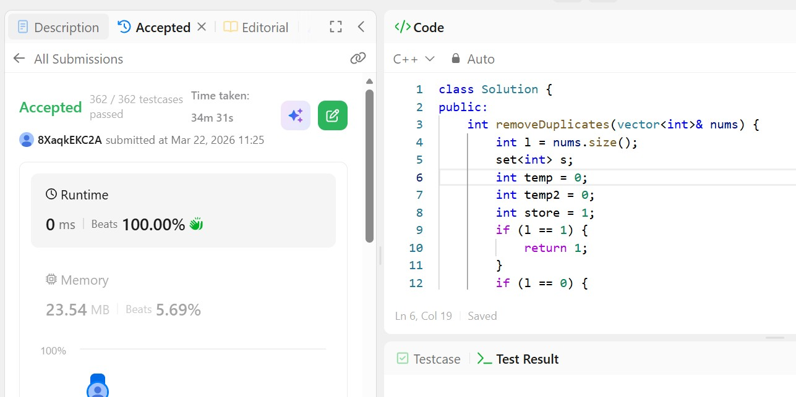

# Day 1 - POTD

## Problem Description

## Approach

Explain how you solved it in simple words.

## 👨‍💻 Code

class Solution {
public:
    int removeDuplicates(vector<int>& nums) {
        int l = nums.size();
        set<int> s;
        int temp = 0;
        int temp2 = 0;
        int store = 1;
        if (l == 1) {
            return 1;
        }
        if (l == 0) {
            return 0;
        }
        for (int i = 0; i < l; i++) {
            for (int j = store; j < l; j++) {
                if (nums[i] != nums[j]) {
                    nums[i + 1] = nums[j];
                    store = j;
                    break;
                }
            }
            temp2 = nums[i];
            s.insert(temp2);
        }
        return s.size();
    }
};

## 📸 Screenshot

