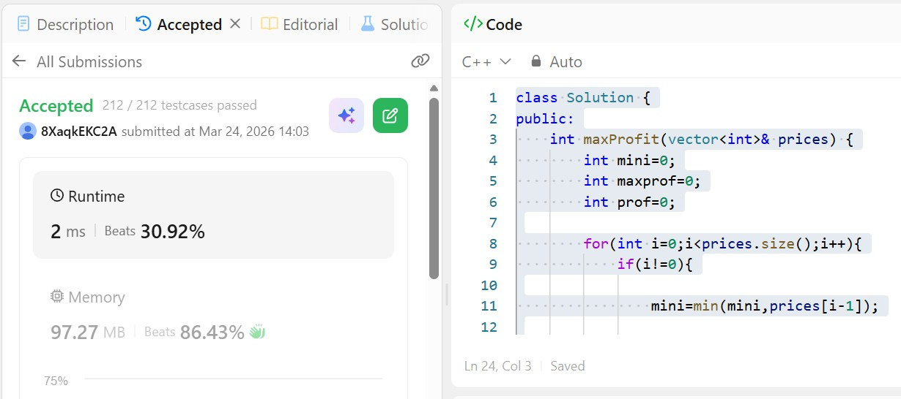

# Day 3 - POTD

## Problem Description
Best Time To Buy and Sell Stock Problem

You are given an array prices where prices[i] is the price of a given stock on the ith day.
You want to maximize your profit by choosing a single day to buy one stock and choosing a different day in the future to sell that stock.
Return the maximum profit you can achieve from this transaction. If you cannot achieve any profit, return 0.

## Approach

This approach solves the **Best Time to Buy and Sell Stock (single transaction)** problem using a greedy strategy.

The idea is to traverse the price array once while keeping track of two things:

* **`mini`**: the minimum price seen so far (best day to buy)
* **`maxprof`**: the maximum profit achievable so far

At each step, the algorithm:

1. Updates the minimum price (`mini`) using the previous day's price.
2. Calculates the profit if the stock is sold on the current day (`prices[i] - mini`).
3. Updates the maximum profit if the current profit is higher.

This ensures that at any point, we are always buying at the lowest possible price before selling.

**Key characteristics:**

* Time Complexity: **O(n)** (single pass)
* Space Complexity: **O(1)** (no extra space used)

Overall, this is an optimal and commonly used greedy solution for this problem.

## 👨‍💻 Code

class Solution {
public:
    int maxProfit(vector<int>& prices) {
        int mini=0;
        int maxprof=0;
        int prof=0;
        for(int i=0;i<prices.size();i++){
            if(i!=0){
                mini=min(mini,prices[i-1]);
                prof=prices[i]-mini;
                maxprof=max(prof,maxprof);
            }else{
                mini=prices[i];
            }
        }
        return maxprof;             
    }
};

## 📸 Screenshot

