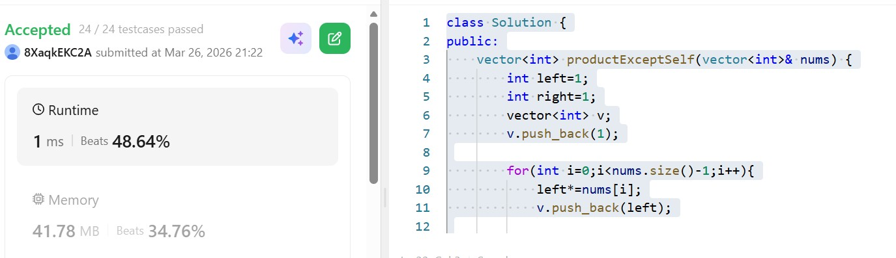

# Day 5 - POTD

## Problem Description
Product of array except Self problem

Given an integer array nums, return an array answer such that answer[i] is equal to the product of all the elements of nums except nums[i].

The product of any prefix or suffix of nums is guaranteed to fit in a 32-bit integer.

You must write an algorithm that runs in O(n) time and without using the division operation.

## Approach

Instead of using division, the algorithm computes:

* **Prefix products (left side)**: product of all elements before the current index
* **Suffix products (right side)**: product of all elements after the current index

### How It Works

1. **First loop (left products)**:

   * Traverse from left to right.
   * Maintain a running product `left`.
   * Store the product of elements before each index in vector `v`.

2. **Second loop (right products)**:

   * Traverse from right to left.
   * Maintain a running product `right`.
   * Multiply the existing values in `v` (which already contain left products) with right-side products.

3. **Final result**:

   * Each index contains the product of all elements except itself.

### Complexity

* **Time Complexity**: O(n) (two linear passes)
* **Space Complexity**: O(1) extra space (excluding output vector)

## 👨‍💻 Code

class Solution {
public:
    vector<int> productExceptSelf(vector<int>& nums) {
        int left=1;
        int right=1;
        vector<int> v;
        v.push_back(1);
        for(int i=0;i<nums.size()-1;i++){
            left*=nums[i];
            v.push_back(left);
        }
        for(int j=nums.size()-1;j>0;j--){
            right*=nums[j];
            v[j-1]*=right;
        }
        return v;
        
    }
};
## 📸 Screenshot

