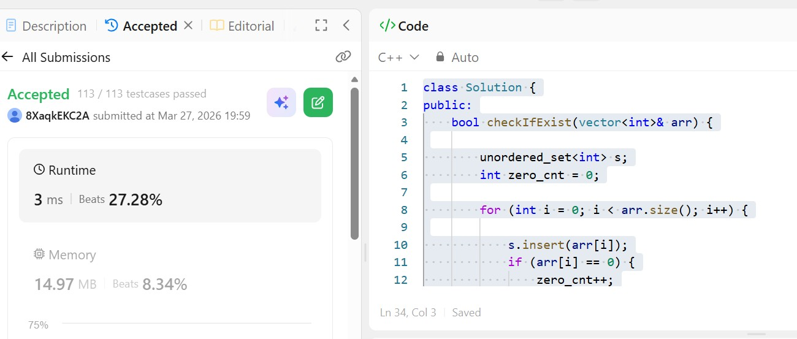

# Day 6 - POTD

## Problem Description
Check if N and its Double exists problem

Given an array arr of integers, check if there exist two indices i and j such that :

i != j
0 <= i, j < arr.length
arr[i] == 2 * arr[j]

## Approach

This solution solves the problem of checking whether there exist two indices ( i \neq j ) such that ( arr[i] = 2 \times arr[j] ) using a hash-based approach.

First, it iterates through the array and stores all elements in an `unordered_set` for constant-time lookup. During this pass, it also counts the number of zeros separately because zero is a special case (since ( 0 = 2 \times 0 )).

In the second iteration:

* If the current element is zero, the function returns `true` only if there is more than one zero in the array.
* For non-zero elements, it computes double the value and checks whether this value exists in the set using efficient lookup.

This approach avoids nested loops and reduces the time complexity to **O(n)**, while the space complexity is also **O(n)** due to the use of the hash set.

## 👨‍💻 Code

class Solution {
public:
    bool checkIfExist(vector<int>& arr) {
        unordered_set<int> s;
        int zero_cnt = 0;
        for (int i = 0; i < arr.size(); i++) {
            s.insert(arr[i]);
            if (arr[i] == 0) {
                zero_cnt++;
            }
        }
        for (int i = 0; i < arr.size(); i++) {
            if (arr[i] == 0 && zero_cnt > 1) {
                return true;
            } else if (arr[i] == 0 && zero_cnt == 1) {
                continue;
            } else {
                int dub = arr[i] * 2;
                auto it = s.find(dub);
                if (it != s.end()) {
                    return true;
                }
            }
        }
        return false;
    }
};
## 📸 Screenshot

