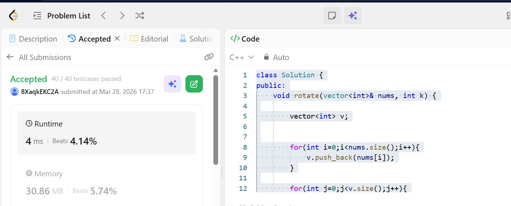

# Day 7 - POTD

## Problem Description
Array Rotation problem

Given an integer array nums, rotate the array to the right by k steps, where k is non-negative.

## Approach

This approach solves the array rotation problem by using an auxiliary array. First, all elements of the original array `nums` are copied into a temporary vector `v`. This preserves the original values while modifying the array.

Next, each element from the temporary vector is placed into its correct rotated position in the original array. The new index for each element is calculated using the formula `(j + k) % n`, where `j` is the current index and `n` is the size of the array. The modulo operation ensures that the index wraps around when it exceeds the array length.

This method has a time complexity of O(n), as the array is traversed twice, and a space complexity of O(n) due to the use of the extra vector. 

## 👨‍💻 Code

class Solution {
public:
    void rotate(vector<int>& nums, int k) {
        vector<int> v;
        for(int i=0;i<nums.size();i++){
            v.push_back(nums[i]);
        }
        for(int j=0;j<v.size();j++){ 
            int index=(j+k)%nums.size();
            nums[index]=v[j];
        }  
       
    }
};
## 📸 Screenshot

