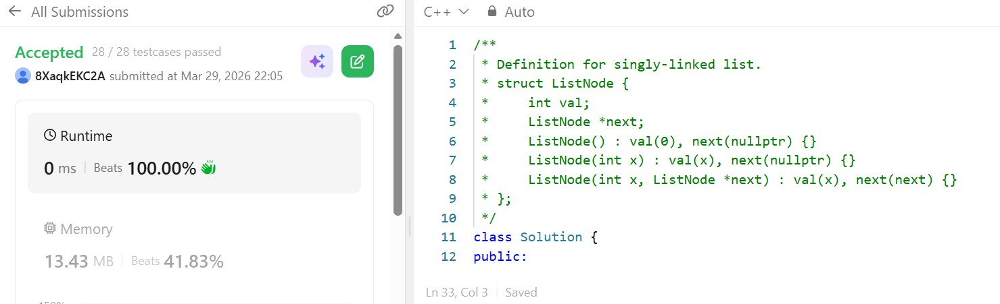

# Day 8 - POTD

## Problem Description
Reversing Linked List problem

Given the head of a singly linked list, reverse the list, and return the reversed list.

## Approach

This approach reverses a singly linked list using an **iterative three-pointer technique**. It maintains three pointers: `curr` (current node), `prev` (previous node), and `after` (next node). Initially, `prev` is set to `nullptr` and `curr` starts at the head.

The algorithm traverses the list while updating links one by one. For each node, it reverses the `next` pointer to point to the previous node, then shifts all three pointers forward (`prev` moves to `curr`, `curr` moves to `after`, and `after` advances to the next node). This ensures that the original links are not lost during reversal.

The loop continues until the last node is reached. Finally, the last node’s pointer is reversed, and it becomes the new head of the list.

This method works in **O(n) time** and uses **O(1) extra space**, making it an efficient in-place solution for reversing a linked list.
 

## 👨‍💻 Code

/**
 * Definition for singly-linked list.
 * struct ListNode {
 *     int val;
 *     ListNode *next;
 *     ListNode() : val(0), next(nullptr) {}
 *     ListNode(int x) : val(x), next(nullptr) {}
 *     ListNode(int x, ListNode *next) : val(x), next(next) {}
 * };
 */
class Solution {
public:
    ListNode* reverseList(ListNode* head) {
        ListNode* curr = head;
        ListNode* prev = nullptr;
        
        if (head==nullptr) {
            return nullptr;
        } else {
            ListNode* after = head->next;
            while (curr->next != nullptr) {
                curr->next = prev;
                prev = curr;
                curr = after;
                after = after->next;
            }
            curr->next = prev;
            head = curr;
            return head;
        }
    }
};/**
 * Definition for singly-linked list.
 * struct ListNode {
 *     int val;
 *     ListNode *next;
 *     ListNode() : val(0), next(nullptr) {}
 *     ListNode(int x) : val(x), next(nullptr) {}
 *     ListNode(int x, ListNode *next) : val(x), next(next) {}
 * };
 */
class Solution {
public:
    ListNode* reverseList(ListNode* head) {
        ListNode* curr = head;
        ListNode* prev = nullptr;
        if (head==nullptr) {
            return nullptr;
        } else {
            ListNode* after = head->next;
            while (curr->next != nullptr) {
                curr->next = prev;
                prev = curr;
                curr = after;
                after = after->next;
            }
            curr->next = prev;
            head = curr;
            return head;
        }
    }
};
## 📸 Screenshot

