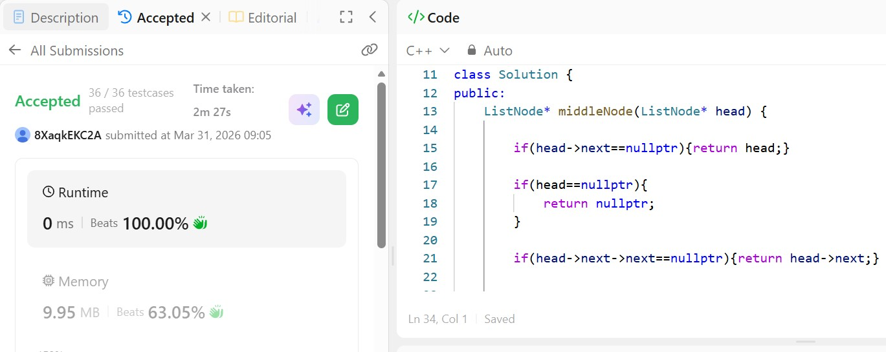

# Day 10 - POTD

## Problem Description
Given the head of a singly linked list, return the middle node of the linked list.

If there are two middle nodes, return the second middle node.

### Approach:

* Two pointers are initialized:

  * `slow` moves **one step at a time**
  * `fast` moves **two steps at a time**
* As the loop progresses:

  * When `fast` reaches the end of the list, `slow` will be at the middle.

### Key Idea:

Since `fast` moves twice as quickly as `slow`, by the time `fast` traverses the entire list, `slow` has covered half the distance, landing exactly at the middle node.

### Edge Cases Handled:

* If the list has only one node → return that node.
* If the list has two nodes → return the second node (as per problem requirement of returning the second middle in even-length lists).

### Complexity:

* **Time Complexity:** O(n) — single traversal of the list.
* **Space Complexity:** O(1) — no extra space used.
 

## 👨‍💻 Code

/**
 * Definition for singly-linked list.
 * struct ListNode {
 *     int val;
 *     ListNode *next;
 *     ListNode() : val(0), next(nullptr) {}
 *     ListNode(int x) : val(x), next(nullptr) {}
 *     ListNode(int x, ListNode *next) : val(x), next(next) {}
 * };
 */
class Solution {
public:
    ListNode* middleNode(ListNode* head) {

        if(head->next==nullptr){return head;}

        if(head==nullptr){
            return nullptr;
        }

        if(head->next->next==nullptr){return head->next;}

        

        ListNode *slow=head;
        ListNode *fast=head;

        while(fast!=nullptr&&fast->next!=nullptr){
            fast=fast->next->next;
            slow=slow->next;
        }

        return slow;

        
    }
};
## 📸 Screenshot

